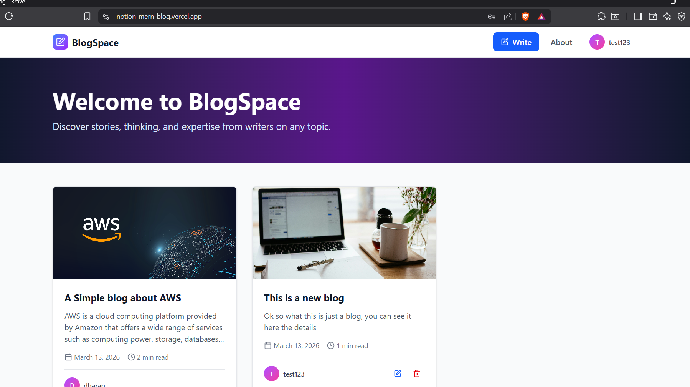

# 📝 Notion Blog

A full-stack blogging platform inspired by Notion's clean design. Write, publish, and manage blogs with a minimal and elegant editing experience.

🔗 **Live Demo:** [notion-mern-blog.vercel.app](https://notion-mern-blog.vercel.app)

---

## Screenshot



---

## Features

- **Notion-style editor** — clean, distraction-free writing experience
- **Authentication** — secure JWT-based login and registration
- **Public & private pages** — anyone can read blogs, only the author can edit or delete
- **Image uploads** — cover images stored on Supabase Storage
- **Responsive design** — works across all screen sizes

---

## Tech Stack

### Frontend

- React (Vite)
- Tailwind CSS
- Axios

### Backend

- Node.js + Express
- MongoDB + Mongoose
- JWT Authentication

### Storage & Deployment

- Supabase — image storage
- Vercel — frontend hosting
- Render — backend hosting
- MongoDB Atlas — cloud database

---

## Getting Started

### Prerequisites

- Node.js
- MongoDB Atlas account
- Supabase account

### Installation

1. **Clone the repo**

```bash
git clone https://github.com/balankdharan/notion-mern-blog.git
cd notion-mern-blog
```

2. **Install backend dependencies**

```bash
cd backend
npm install
```

3. **Install frontend dependencies**

```bash
cd client
npm install
```

4. **Set up environment variables**

Create `backend/.env`:

```env
MONGODB_URI=your_mongodb_atlas_uri
JWT_SECRET=your_jwt_secret
PORT=5000
```

Create `client/.env`:

```env
VITE_API_URL=http://localhost:5000/api
VITE_SUPABASE_URL=yourURL
VITE_SUPABASE_ANON_KEY=yourURL
```

5. **Run the app**

```bash
# Backend
cd backend
node server.js

# Frontend (separate terminal)
cd client
npm run dev
```

---

## Project Structure

```
notion-mern-blog/
├── backend/
│   ├── controllers/
│   ├── models/
│   ├── routes/
│   └── server.js
├── client/
│   ├── src/
│   │   ├── components/
│   │   ├── pages/
│   │   └── api/
│   └── index.html
└── .gitignore
```

---

## License

MIT
